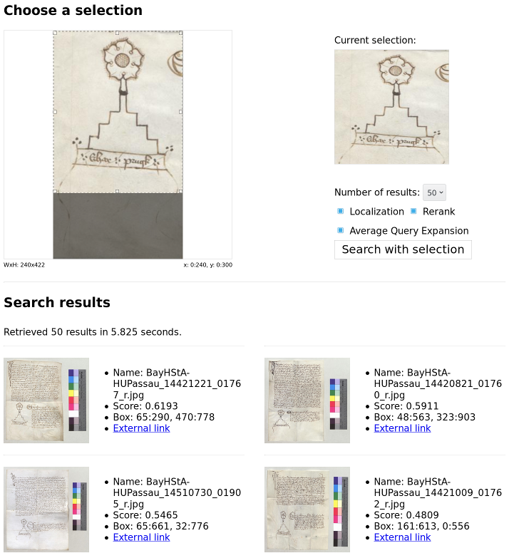
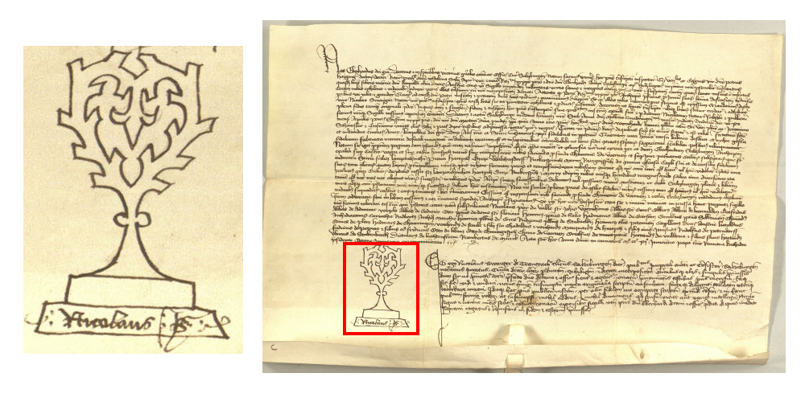

# Historic Image Retrieval using Deep Features

This repository contains the implementation of an image retrieval system. 
The project was implemented using Python, Tensorflow and Keras. 
The implementation follows [this paper](https://arxiv.org/abs/1511.05879) from Tolias et al, who make use of global image descriptors obtained from Convolutional Neural Networks. 
For ease of testing, the project also includes a simple web frontend which allows to query the extracted image descriptor database interactively.

The system was designed for the application of finding recurring occurences of patterns in historical documents, e.g. a certain sign. 
A system like this could potentially simplify the life of historians, who currently have to sift through heaps of scanned documents by hand.

Contributions of this project:
- Providing a flexible implementation of an image retrieval system
- Introducing a [new dataset](#notary-charters-dataset) for pattern spotting on historical documents

See also the [research report](http://www.max-seitzer.de/files/static/pattern-spotting.pdf) for an evaluation of the system and possible future directions.



## Setup

#### Prerequisites:

- Get all dependencies using [Conda](https://conda.io/): `conda env create -n img-retrieval -f environment.yml`
- Activate the environment: `source activate img-retrieval`
- Setup the folder structure: `make setup`
- Download the notary charters dataset: `make dataset-notary-charters`

#### Building the image descriptor database:

```DATASET=notary_charters IMAGE_DIR=data/interim/notary_charters/notary_charters make repr```

Here, `DATASET` contains the name referring to the generated dataset, and `IMAGE_DIR` is the directory containing the images used for the image database. 
It might take a while until the process is finished.

#### Query the image database using the commandline:

```cmd/query --features features/notary_charters --model VGG16 <query_image>```

#### Query the image database using the web frontend:

- Setup the image metadata database: `cmd/modify_database.py --root-dir data/ create database/notary_charters.db data/interim/notary_charters/notary_charters.csv`

- Start the web server on localhost:
```
cd web
./main.py --config config_notary_charters.txt
```

- You can access the web frontend on localhost:5000

#### Evaluating the performance of the retrieval system:

```make evaluate-notary-charters```

The evaluation uses hand-labeled pattern occurences, which is why it is only available for the notary charters dataset. 
The evaluation scripts reports:
- retrieval performance as mAP, i.e. the mean average precision over all correctly retrieved images
- localization performance as mAP, i.e. the mean average precision over all correctly retrieved and localized patterns
- localization performance as IoU, i.e. the intersection over union score of all correctly retrieved patterns

## Repository Structure

```
cmd/          # Commandline scripts to interact with the library
data/         # Images and annotations
models/       # Evaluation and trained models, if any
src/          # The main library
src/data      # Code setting up the datasets
src/features  # Code extracting the image features
src/models    # Code loading the CNNs
src/search    # Code implementing the retrieval algorithm
web/          # The web frontend
```

## Notary charters dataset

Notary charters were used in the classical and medieval eras as legal documents. 
Each notary had his own sign to identify himself and prove the authenticity of the document. 
In order to make it harder to fake them, the signs were really graphically elaborate. 
Historians often search for corresponding signs as they link the documents on which they appear together. 



As in the domain of historical documents there is next to no annotated data available (we know only of [DocExplore](http://spotting.univ-rouen.fr/), but they provide no annotations), we had to build our own dataset in order to evaluate our approach.
We now provide this dataset, namely of notary charters and notary signs, here.

The dataset consists of 977 images of notary charters, all from [monasterium.net](monasterium.net).
On those images, 606 search patterns (different notary signs) were hand-annotated with bounding boxes. 
Then, 295 of the patterns were sorted into 77 correspondency groups with on average 3.8 patterns per group. 
The remaining 311 patterns appear only once and have no corresponding patterns on other images.

There is also a second, larger dataset which consists of the 977 notary charter images and 31215 distractor images which make the retrieval task harder.

## References

- [Giorgos Tolias, Ronan Sicre, Hervé Jégou - Particular object retrieval with integral max-pooling of CNN activations](https://arxiv.org/abs/1511.05879)
- [Matlab implementation of Particular object retrieval with integral max-pooling of CNN activations](http://cmp.felk.cvut.cz/~toliageo/soft.html)
- [Monasterium for the notary charters images](http://monasterium.net/mom/home)
